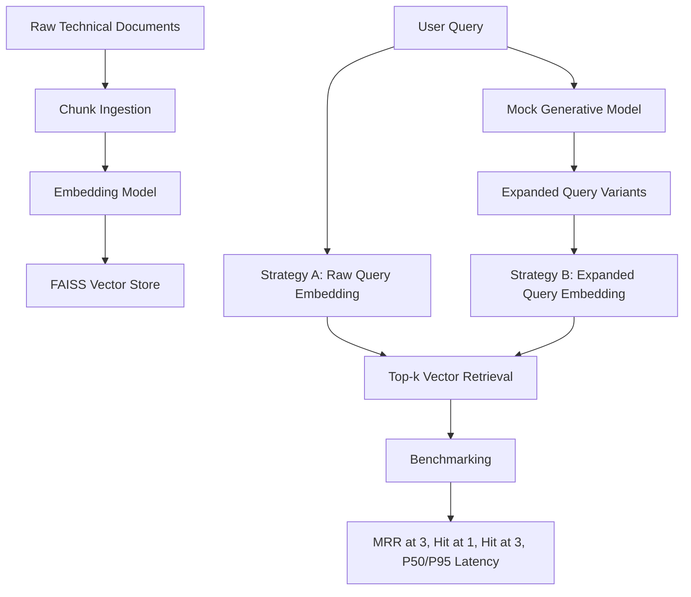

# GenAI RAG Vector Search Assessment

A local semantic retrieval engine that compares two retrieval strategies for a Retrieval-Augmented Generation (RAG) pipeline:

1. **Strategy A — Raw Vector Search**  
   The user query is embedded directly and searched against a FAISS vector index.

2. **Strategy B — AI-Enhanced Retrieval**  
   A mocked generative model rewrites the query into more retrieval-friendly variants before vector search.

This project was built for a Senior GenAI / GCP-style assessment focused on embeddings, vector databases, retrieval logic, query expansion, benchmarking, and production migration to Vertex AI Vector Search.

---

## Why this project exists

Many RAG systems fail not because the vector database is weak, but because the original user query does not always match the vocabulary of the indexed documents.

For example:

> “How does the system handle peak load?”

may need to be expanded into terms such as:

> autoscaling, load balancing, rate limiting, traffic spikes, horizontal scaling, backpressure, throughput, and latency.

This repo tests whether query expansion improves retrieval quality compared with raw embedding search.

---

## Architecture



---

## Repository structure

```text
genai-rag-vector-search/
│
├── data/
│   └── corpus.py
│
├── src/
│   ├── benchmarker.py
│   ├── embeddings.py
│   ├── query_expansion.py
│   ├── retrieval.py
│   └── vector_store.py
│
├── tests/
│   ├── test_benchmarker.py
│   ├── test_embeddings.py
│   └── test_retrieval.py
│
├── benchmark_results.json
├── retrieval_benchmark.md
├── main.py
├── requirements.txt
└── README.md
```

---

## Core features

- Local RAG-style semantic retrieval pipeline
- FAISS vector search
- Sentence-transformers embedding support
- Mock Vertex-style embedding model for deterministic testing
- Mock generative model for query expansion
- Strategy A vs Strategy B benchmark
- MRR@3, Hit@1, Hit@3 evaluation
- P50 and P95 latency reporting
- Markdown and JSON benchmark outputs
- Pytest coverage for the retrieval pipeline
- Vertex AI Vector Search migration guide

---

## Installation

```bash
git clone https://github.com/ShubhamKosaiker/genai-rag-vector-search.git
cd genai-rag-vector-search

python -m venv venv
```

Activate the environment:

```bash
# macOS/Linux
source venv/bin/activate
```

```bash
# Windows
venv\Scripts\activate
```

Install dependencies:

```bash
pip install -r requirements.txt
```

---

## Run the benchmark

Use mock embeddings for a fast deterministic run:

```bash
python main.py --mock
```

Use local sentence-transformers embeddings:

```bash
python main.py
```

The script writes two output files:

```text
benchmark_results.json
retrieval_benchmark.md
```

---

## Run tests

```bash
pytest
```

---

## Benchmark summary

The benchmark compares raw vector search against query-expanded retrieval across four complex technical queries.

Full results, per-query breakdowns, and latency analysis are available in [retrieval_benchmark.md](retrieval_benchmark.md).
---

## Key finding

Query expansion improved aggregate retrieval quality, especially when the user query used broad natural language and the corpus used more technical implementation terms.

However, the benchmark also shows that query expansion does not improve every query. One query regressed because the expanded query drifted away from the most relevant chunks.

This reflects an important production lesson:

> Query expansion should be evaluated offline using labelled queries, MRR, Hit@k, latency, and regression tests before being deployed into a production RAG system.

---

## Limitations

This project is intentionally scoped as a local retrieval assessment, not a full production RAG platform.

Current limitations:

- The corpus is small and synthetic, so benchmark scores should be treated as directional rather than definitive.
- Query expansion is mocked to make the benchmark deterministic and testable.
- The system focuses on retrieval only; it does not include a final answer-generation layer.
- FAISS runs locally, so this does not yet include distributed indexing, access control, or managed production scaling.
- The benchmark uses a small labelled query set. A production evaluation would need more queries, human relevance labels, and regression tracking.

These limitations are deliberate because the goal is to demonstrate retrieval design, vector search logic, query expansion, evaluation, and a clear migration path to managed GCP infrastructure.

---

## Similarity metric choice

This project uses cosine similarity.

FAISS `IndexFlatIP` computes inner product. By L2-normalising both document embeddings and query embeddings, inner product becomes equivalent to cosine similarity.

Cosine similarity is preferred over Euclidean distance for semantic retrieval because it focuses on vector direction rather than magnitude. This is useful when comparing text chunks of different lengths.

---

## Production migration to Vertex AI Vector Search

The local FAISS implementation can be migrated to Vertex AI Vector Search as follows:

| Local component | Production GCP equivalent |
|---|---|
| `sentence-transformers/all-MiniLM-L6-v2` | Vertex AI text embeddings |
| FAISS `IndexFlatIP` | Vertex AI Vector Search index |
| Local query expansion mock | Gemini query rewriting |
| Local benchmark script | Offline evaluation pipeline |
| Local JSON/Markdown output | Monitoring dashboard and evaluation store |

Migration steps:

1. Replace the local embedding model with Vertex AI text embeddings.
2. Batch-embed the document corpus.
3. Upload vectors and metadata to Vertex AI Vector Search.
4. Deploy the index to a managed endpoint.
5. Replace local FAISS search with `find_neighbors`.
6. Replace the mocked generative model with Gemini.
7. Track retrieval latency, Hit@k, MRR, empty-result rate, and query rewrite failures.
8. Validate query expansion with real embeddings before promoting it to production.

---

## Production considerations

In a real production RAG system, I would add:

- Larger and domain-specific document corpus
- Chunking strategy experiments
- Human-labelled relevance dataset
- Offline retrieval evaluation pipeline
- Query rewrite guardrails
- RAGAS-style answer evaluation
- Observability for latency, retrieval quality, and empty-result rate
- Authentication and IAM for managed infrastructure
- CI/CD pipeline for tests and benchmark regression checks

---

## Tech stack

- Python
- FAISS
- NumPy
- sentence-transformers
- pytest
- Mocked Vertex AI-style embedding and generation classes

---

## Notes

This is a local assessment implementation, not a full production RAG platform.

The goal is to demonstrate:

- retrieval design
- query expansion
- vector search logic
- benchmarking
- similarity metric reasoning
- production migration thinking
- clean, testable Python structure
